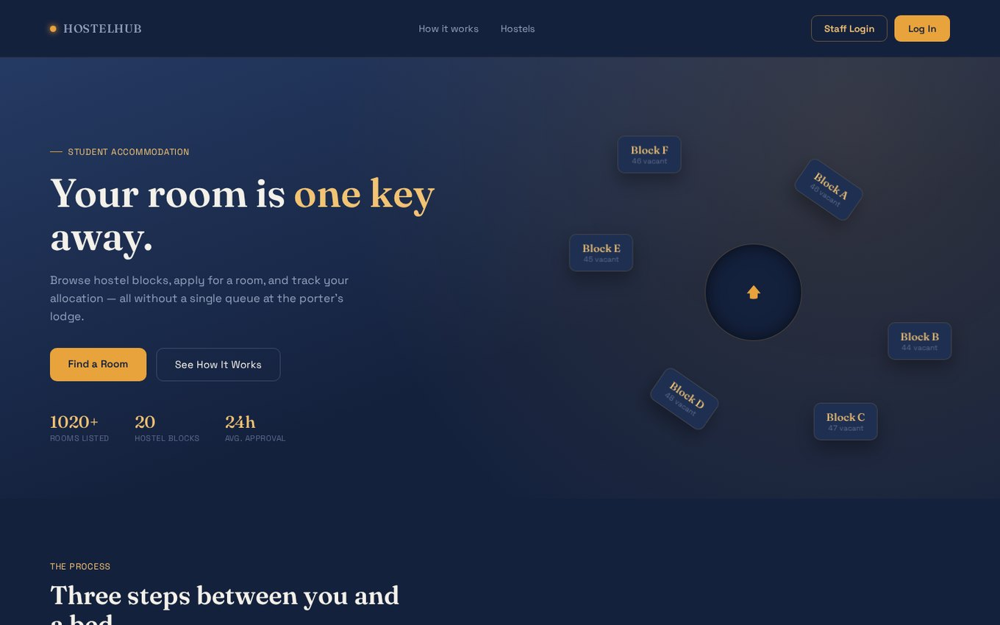
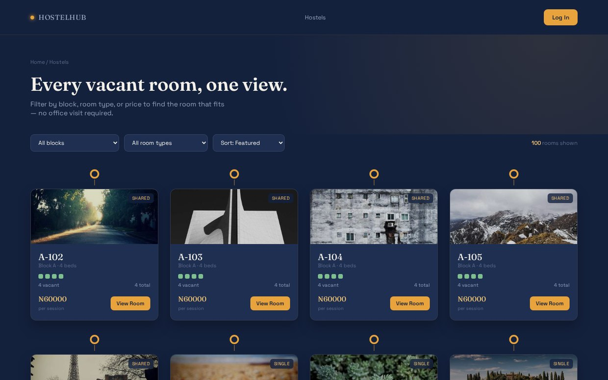
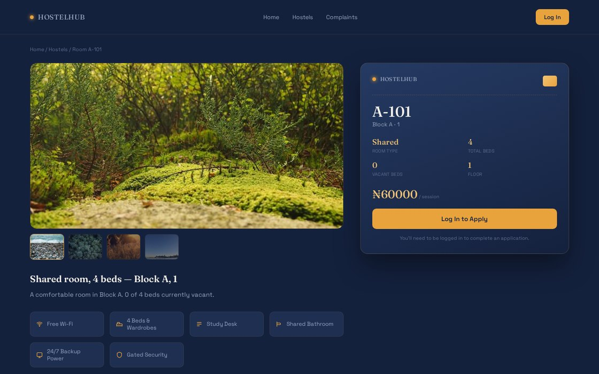
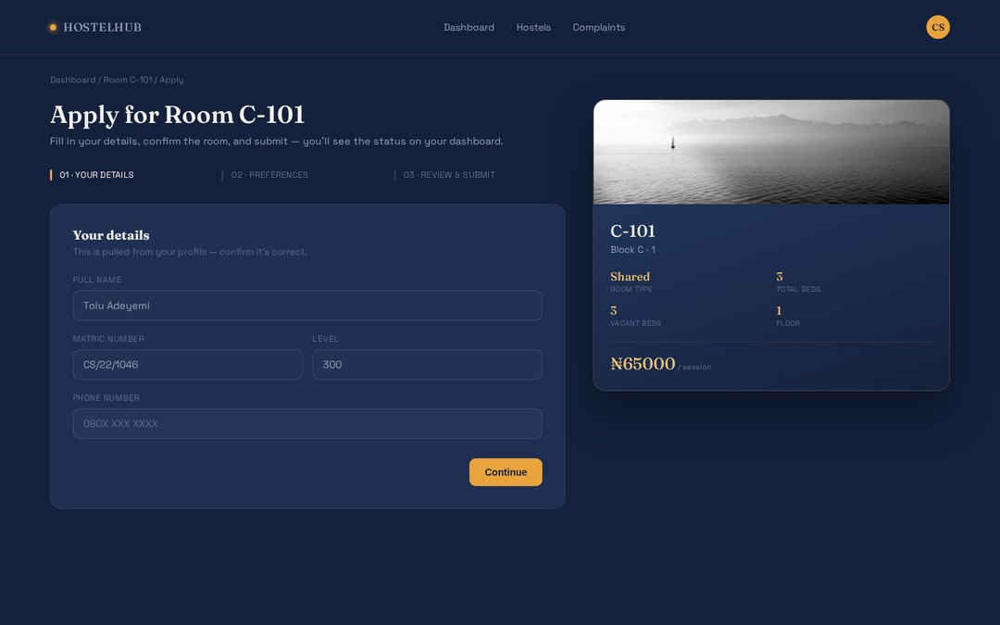
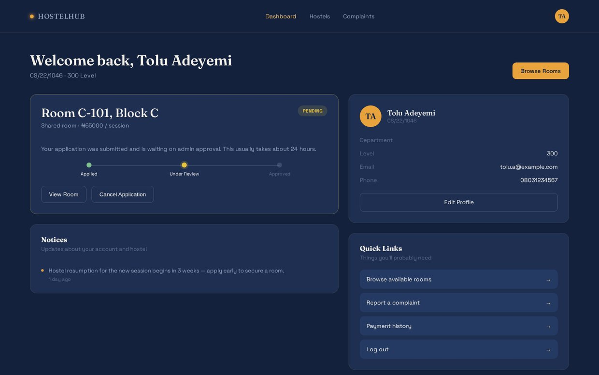
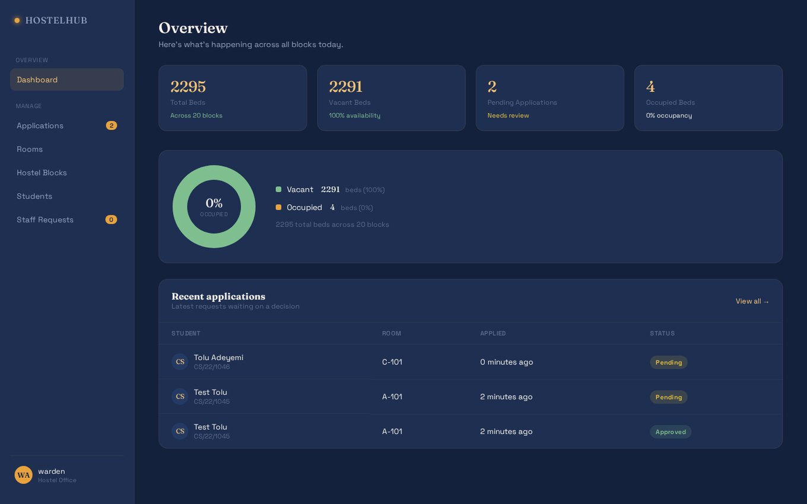
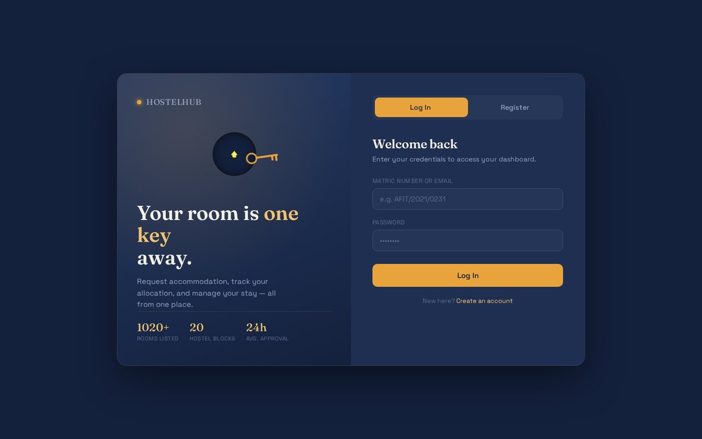
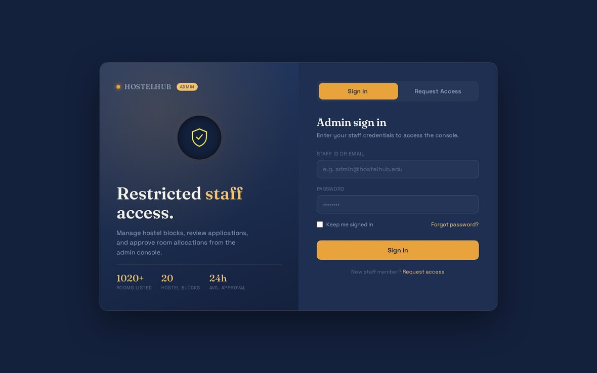

---
# Hide GitHub's auto-generated table of contents - the hero image and
# section headings read better here than a boxed list. Delete these four
# lines if you would rather GitHub render one.
toc: false
---



# HostelHub

A self-service room portal for a 20-block student hostel — browse vacancies, apply for a bed, and let the warden approve it.

Built with Django 6.1. No queues at the porter's lodge, no paper forms, no "come back tomorrow".


---

## What it does

| | |
|---|---|
| **Browse** | Every room with at least one free bed, filtered and searchable by hostel block |
| **Apply** | One active application per student, with session year and special requests |
| **Track** | Live status on the student dashboard: `pending` → `approved` / `rejected` |
| **Decide** | Warden approves or rejects applications, with capacity enforced on approval |
| **Onboard staff** | Anyone can request admin access; the account stays locked until an existing admin approves it |

The inventory is real, not mocked: 20 hostel blocks × 51 rooms = **1,020 rooms / 2,295 beds**, seeded by a management command and computed live from the database in the admin overview.

---

## Quick start

```bash
git clone https://github.com/Viod-01/HostelHub.git
cd HostelHub/myproject

python -m venv .venv && source .venv/bin/activate   # Windows: .venv\Scripts\activate
pip install -r requirements.txt

python manage.py migrate
python manage.py seed_rooms                          # creates all 20 blocks; safe to re-run
python manage.py createsuperuser                     # your first warden account

python manage.py runserver
```

Open http://127.0.0.1:8000

> **Why `createsuperuser`?** Staff approvals are gated on `is_staff`. The first approved
> account has to come from somewhere, so bootstrap one superuser locally — after that,
> new wardens come in through the "Request Access" flow instead.

### Environment

All settings are read through `python-decouple`, so a local `.env` works out of the box. Everything is optional — the app boots with SQLite and no config at all.

```ini
# myproject/.env  (git-ignored)
DEBUG=True
ALLOWED_HOSTS=127.0.0.1,localhost
SECRET_KEY=django-insecure-change-me-in-production-0123456789abcdef
DATABASE_URL=sqlite:///db.sqlite3
```

| Variable | Default | Notes |
|---|---|---|
| `DEBUG` | `False` | Set `True` for local development |
| `ALLOWED_HOSTS` | `127.0.0.1,localhost` | Comma-separated |
| `SECRET_KEY` | *(hardcoded fallback)* | Override this in production — see [Security](#security) |
| `DATABASE_URL` | `sqlite:///db.sqlite3` | Postgres via `dj-database-url`; `RENDER_EXTERNAL_HOSTNAME` is auto-appended to `ALLOWED_HOSTS` |

---

## Screens

**Browse vacancies** — rooms are listed per bed, so a 4-share shows exactly how many beds are still free.


**Room detail → apply** — bed-level breakdown, block pricing, then the application form.



**Student dashboard** — the latest application and its status, without having to ask anyone.


**Warden dashboard** — occupancy across every block, pending applications, and pending staff requests in one view.


**Dual login** — students authenticate with a matric number *or* email; staff have a separate entry point.



---

## How the pieces fit

```
HostelHub/
└── myproject/
    ├── manage.py
    ├── requirements.txt
    ├── build.sh                      # Render build command
    ├── myproject/
    │   ├── settings.py               # env-driven config, Postgres/SQLite switch
    │   └── urls.py                   # all routes in one readable list
    └── portal/
        ├── models.py                 # Hostel, Room, StudentProfile, Booking, StaffAccessRequest
        ├── views.py                  # 13 views, permission enforced here
        ├── admin.py                  # list_display / filters for every model
        ├── migrations/               # 3 migrations
        ├── management/commands/
        │   └── seed_rooms.py         # 20 blocks × 51 rooms
        └── templates/hostel/         # 8 fully self-contained pages
```

### Data model

```
Hostel (block)              Room                    Booking
├─ name                     ├─ hostel      ──FK──►  ├─ student     ──FK──► User
├─ room_type                ├─ room_number (uniq)   ├─ room        ──FK──► Room
│    single | shared |      ├─ floor                 ├─ session
│    self_contain |         └─ occupied_beds         ├─ status  pending|approved|rejected
│    two_bedroom                 ▲                   ├─ special_requests
├─ capacity_per_room               │                 └─ applied_at / decided_at
└─ price_per_session               │
                        StudentProfile ◄── 1:1 ── User
                        ├─ matric_number (uniq)      StaffAccessRequest
                        ├─ department / level        ├─ user        ── 1:1 ─► User
                        └─ phone                     ├─ staff_id (uniq)
                                                     └─ status  pending|approved|rejected
```

`Room.capacity`, `Room.vacant_beds` and `Room.is_full` are derived properties on the block's `capacity_per_room` — occupancy is stored as a single integer per room, which keeps the vacancy filter a cheap `WHERE occupied_beds < capacity_per_room` at the database level.

---

## The two decisions worth reading

### 1. One student, one active application

Enforced in `booking()` rather than with a DB constraint, and it deliberately treats `pending` *and* `approved` as active — a student with an application under review cannot spam a second room to improve their odds, and cannot hold two beds after approval.

### 2. Vacancy is checked twice, at the right moments

A student applying to a full room is bounced back to the listing (`room.is_full`), and a warden approving into a room that filled up while the application sat pending is refused with an explicit message. Beds are only claimed at approval — a pending application reserves nothing, so the vacancy you see on the listing page is genuinely available.

### Self-service staff access, without a privilege-escalation hole

This is the part I'd most want someone to review. An applicant on the admin login page creates a real `User` row immediately, but with `is_active=False` and `is_staff=False`:

```python
user = User.objects.create_user(
    username=staff_id, email=email, password=password, is_active=False,
)
```

Because Django's `authenticate()` already refuses inactive users, the lockout is free — no custom gate, no view-level flag to forget. Only `staff_request_decision("approved")` flips `is_active` and `is_staff` together. A rejected request stays on record but can't sign in anywhere, student side included.

Login failures on the staff page return one generic message whether the account doesn't exist, the password is wrong, or a real account just isn't staff — so the form can't be used to probe which staff IDs are registered.

---

## Routes

| Path | View | Access |
|---|---|---|
| `/` | `landing` | public |
| `/hostels/` | `listing` | public — rooms with a free bed only |
| `/hostels/<room_number>/` | `detail` | public (shows your status if logged in) |
| `/login/`, `/register/submit/` | `login_register`, `login_view`, `register_view` | public |
| `/dashboard/` | `dashboard` | `@login_required` |
| `/hostels/<room_number>/apply/` | `booking` | `@login_required` |
| `/logout/` | `logout_view` | public |
| `/admin-login/` + `/submit/` + `/request/` | staff login & access request | public |
| `/dashboard/admin/` | `admin_dashboard` | `@staff_member_required(login_url='admin_login')` |
| `/dashboard/admin/bookings/<id>/<decision>/` | `booking_decision` | staff only |
| `/dashboard/admin/staff-requests/<id>/<decision>/` | `staff_request_decision` | staff only |
| `/admin/` | Django built-in admin | staff only |

Authentication is split by role at the view layer: a staff account signing in through the *student* form is rejected with a pointer to the admin page, so the two entry points can't be mixed.

---

## Deployment

The project is set up for [Render](https://render.com) — `build.sh` is the build command:

```bash
pip install -r requirements.txt
python manage.py collectstatic --no-input
python manage.py migrate
python manage.py createsuperuser --noinput || true
python manage.py seed_rooms
```

Configure on the host: `SECRET_KEY`, `DEBUG=False`, `DATABASE_URL`, `ALLOWED_HOSTS`.

Static files are served by WhiteNoise and `python manage.py check --deploy` is clean apart from the `SECRET_KEY`-length warning (it fires on any throwaway dev key, including the ones used above).

> **Rotate the old key.** `SECRET_KEY` was committed as a literal until recently, so the
> previous value must be treated as public: it can forge signed cookies and session data.
> It now reads from the environment with a dev-only fallback, so set a fresh one on the host.

---

## Known limitations

Stated plainly, because a portfolio project is more credible for them than without them:

- **Booking acceptance is not atomic.** `booking_decision` does a read-modify-write on `occupied_beds` without `transaction.atomic()` + `select_for_update()`, so two wardens approving simultaneously could overbook the last bed. The `is_full` guard makes this a rare race, not a common one.
- **No password reset or profile editing.** A forgotten password has no self-service path; the only recovery is editing `auth_user` in Django admin.
- **The listing page sends every room and hides most of it.** ~1,020 cards are rendered server-side (about 1 MB of HTML) and trimmed to a 5-per-block preview in client JS, because `listing()` has no limit or pagination. Correct on screen, wasteful on the wire.
- **Photos are `picsum.photos` placeholders**, resolved at runtime by a third party, and the favicon is a `.jpg` declared as `image/png`. Swap in real block photography before showing this to anyone who might take the images literally.
- **A room holds beds, not people.** `occupied_beds` is an integer; nothing links an approved booking to a specific bed, and there is no move-out or cancellation path that releases one.
- **Decisions have no author.** `Booking` records `decided_at` but not which warden approved, so there is no audit trail.
- **No tests, and no CI.** `portal/tests.py` is still the empty scaffold. The behaviours on this page were confirmed by hand against a running instance, which is not a substitute.
- **Rejection is terminal.** A rejected student must register a fresh account to reapply, and the rejected application stays on their dashboard.

### Fixed in the current history

Worth listing because each was a live bug, not a code-smell, and the fixes are in `git log`:

- `Room.room_number` was `unique=True` in the model but **the constraint never reached the schema** — the initial migration omitted it. Two rooms sharing a number made `detail()`/`booking()` raise `MultipleObjectsReturned` (HTTP 500), since both look rooms up by number with `.get()`.
- `register_view` wrote `User` and `StudentProfile` in two unguarded steps, so a failure between them left an **active account that could log in, 404 on every page, and could never re-register** (its matric number was taken). Now wrapped in `transaction.atomic()` with `level` and `matric` validated first.
- `whitenoise` was installed but absent from `MIDDLEWARE`, so `/static/` was 404 in production; and `STATICFILES_STORAGE` was a **no-op since Django 5.1 removed it**, leaving `STORAGES` on the plain default.
- `seed_rooms` force-saved `price_per_session`/`capacity_per_room` on every block, and `build.sh` runs it on **every deploy** — so a warden's admin edits were silently reverted on the next push. It is now insert-only.
- `request_access` never checked email uniqueness, while `admin_login_submit` resolves identifiers via `filter(email=...).first()` — two staff requests sharing an email could authenticate against the first account.
- `admin_login.html` rendered its own generic text instead of the view's messages, so every rejection on the staff page said the same thing.
- `landing()` ran no query, so the hero counts and per-block "vacant" chips were **hardcoded HTML** that would not change as rooms filled. They are computed now; the "24h" figure is labelled as a target, because nothing measures actual decision latency yet.
- Two nav bugs: `listing.html` had two independent `` blocks that drew "Log In" twice for guests, and `landing.html` showed it to signed-in students. The dead `Complaints` link (no model, view or URL behind it) is gone.

---

## Roadmap

- [ ] `transaction.atomic()` + `select_for_update()` around approval, and a partial unique index enforcing one-active-booking-per-student at the DB level
- [ ] Pagination or a server-side limit on the room listing
- [ ] Move payments out of "price per session" text into an actual invoicing record
- [ ] Email notifications on approve/reject (`EMAIL_BACKEND` is currently the console backend)
- [ ] Per-bed allocation so a shared room shows *which* bed is yours
- [ ] Tests for the booking, registration and staff-access lifecycles, with GitHub Actions
- [ ] Split the admin dashboard's client-side views into real routes

---

## Tech

**Django 6.1** · `dj-database-url` for SQLite/Postgres parity · `python-decouple` for env config · **gunicorn** + **WhiteNoise** for serving · vanilla HTML/CSS/JS templates with no build step, no CSS framework, and no client-side framework — the eight pages are self-contained by design.

## License

Released under the MIT License.

---

*Screenshots in `docs/img/` were captured from the app running locally (Django 6.1 + SQLite, `seed_rooms` data). Replace them with your own once the data looks the way you want — `python manage.py seed_rooms` gives a clean, empty-inventory start.*
